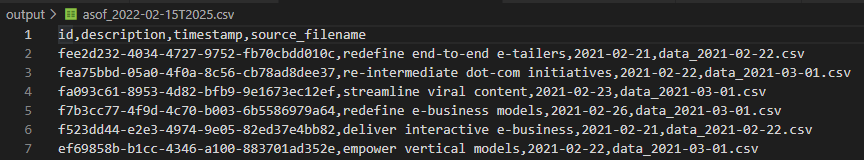
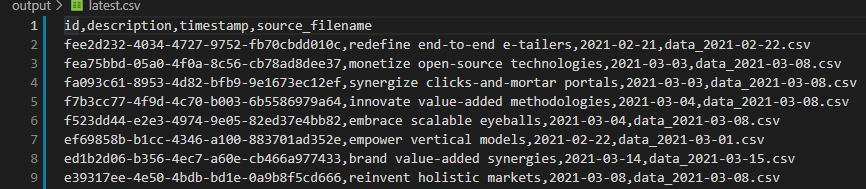

# Demo

## Synthetic dataset creation using Faker
1. Uses Faker library to generate synthetic data
   
    
2. 100,000 rows split into 50 files ordered by date 
   
    
3. Imitates a data workflow where csv files are received on a 1-2 week cadence and files are timestamped accordingly

    

## Batch processing of input csv files
1. code in csv_utils.py, function batch_process()
2. file management to track processed and unprocessed
3. snapshot creation of ./output/latest.csv
   

4. updating ./output/latest.csv

5. You can tell the latest.csv was updated for the id in row 3.  There is a new description string, timestamp, and source_filename

# Key Takeaways
1. Synthetic dataset creation using Faker
2. Snapshot management of the output data
3. Python requirements.txt and virtual environment setup

# Features to implement in the future
1. Logging
2. More decision and logistics around what data to keep.  Maybe we don't decide to keep the input data and it's fine to just have output snapshots.
3. Convenience functions in csv_utils.py 
   1. cleaning existing data and starting from scratch. 
   2. resetting latest.csv to a previous snapshot
   3. 